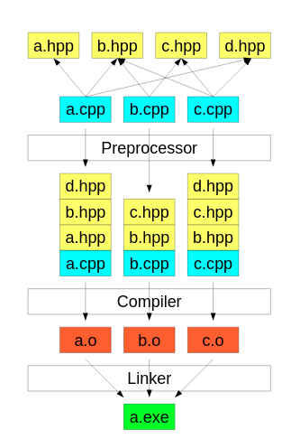
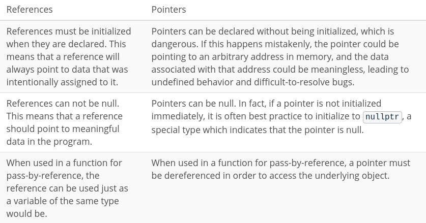

# C++ Nanodegree program notebook
Some notes taken during this C++ course.

## Table of contents
* [Compilation](#compilation)
* [Constants](#constants)
* [Initializer lists](#initializer-lists)
* [References and Pointers](#references-and-pointers)
* [Structures](#structures)
* [Invariants](#invariants)
* [Inheritance vs Composition](#inheritance-vs-composition)
  * [Inheritance](#inheritance)
    * [Friends](#friends)
  * [Composition](#composition)
* [Polymorphism](#polymorphism)
  * [Overloading](#overloading)
  * [Overriding](#overriding)
    * [Virtual functions](#virtual-functions)

### Compilation
C++ is a compiled programming language, which means that programmers use a program to compile their human-readable source code into machine-readable object and executable files. The program that performs this task is called a compiler.



In order to use classes and functions from the C++ Standard Library, the compiler must have access to a compiled version of the standard library, stored in object files. Most compiler implementations, including GCC, include those object files as part of the installation process. In order to use the Standard Library facilities, the compiler must "link" the standard library object files to the object files created from the programmer's source code.

### Constants
C++ supports two notions of immutability:
* `const`: Run time
* `constexpr`: Compile time

_If a variable is set as `static` and initialized inside a class, it has to be `constexpr`.

### Initializer lists
Initializer lists initialize member variables to specific values, just before the class constructor runs. This initialization ensures that class members are automatically initialized when an instance of the class is created, before the object is created.

Constructors should initialize as a rule all member objects in the initialization list. If it's done in the body of the constructor, using `=` assignment operator, it causes a separate, temporary object to be created, and this temporary object is passed into the object's assignment operator and that temporary object is eventually destructed after `;`. Completely inefficient.

Moreover, the member object will get fully constructed by its default constructor, and this might, for example, allocate some default amount of memory or open some default file. All this work could be for naught if the whatever expression and/or assignment operator causes the object to close that file and/or release that memory (e.g., if the default constructor didn't allocate a large enough pool of memory or if it opened the wrong file).

It is mandatory to use initializer lists in the following cases:
1. Initialize a reference
2. Initialize a `const` type
3. Initialize objects which do not have default constructor
4. Initialize base class objects
5. When the constructor's parameter name is same as the attributive of the class

It will not be possible to use initializer lists if [invariants](#invariants) are needed.

### References and Pointers


As a decent rule of thumb, references should be used in place of pointers when possible.

However, there are times when it is not possible to use references. One example is object initialization. You might like one object to store a reference to another object. However, if the other object is not yet available when the first object is created, then the first object will need to use a pointer, not a reference, since a reference cannot be null. The reference could only be initialized once the other object is created.

### Structures
Structures are a user-defined type that allows you to aggregate different other types of data together.

Members of structures can be initialized by default as follows:
```cpp
struct Date
{
  // They are public by default
  int day{1};
  int month{1};
  int year{2000};
  // 1/1/2000
};
```

### Invariants
An invariant is a rule that limits the values of member variables.

As a general rule, member data subject to an invariant should be specified `private`, in order to enforce the invariant before updating the member's value.

### Inheritance vs Composition
Think about an object can do, rather than what is, "has a" (composition) versus "is a" (inheritance).

There is no hard and fast rule about when to prefer composition over inheritance. In general, if a class needs only extend a small amount of functionality beyond what is already offered by another class, it makes sense to inherit from that other class. However, if a class needs to contain functionality from a variety of otherwise unrelated classes, it makes sense to compose the class from those other classes.

#### Inheritance
* `public`: all the members of the base class keep their member access in the derived class.
* `protected`: the public and protected members of the base class change to protected in the derived class.
* `private`: the public and protected members of the base class change to private members of the derived class.

```cpp
#include <vector>
class Vehicle
{
};
class Car : public Vehicle
{
};
```

##### Friends
The `friend` keyword grants access to the private members of a class.
```cpp
class Heart
{
private:
  int rate;
  friend class Human;
};
class Human
{
public:
  int getHeartRate() const
  {
    return heart_.rate;
  }
private:
  Heart heart_;
};
```
_Human_ is a friend class of _Heart_.

#### Composition
```cpp
class Wheel
{
};
class Car
{
public:
  Car() : wheels(4, Wheel())
  {
  };
private:
  std::vector<Wheel> wheels_;
};
```

### Polymorphism
Polymorphism is means "assuming many forms". It describes a paradigm in which a function may behave differently depending on how it is called. In particular, the function will perform differently based on its inputs.

#### Overloading
It happens when there is more than one function named the same with different parameters.

#### Overriding

##### Virtual functions
Virtual functions are a polymorphic feature. These functions are declared (and possibly defined, implemented) in a base class, and can be overridden by derived classes.

Virtual functions can be defined by derived classes, but this is not required. However, if we mark the virtual function with `= 0` in the base class, then we are declaring the function to be a pure virtual function. This means that the base class does not define this function. A derived class must define this function, or else the derived class will be abstract.
```cpp
#include <iostream>
class Base
{
  virtual void virtualPrint()
  {
    std::cout << "I'm the base virtual print and i do not need to be overridden\n";
  }
  // virtual pure function needs to be overridden
  virtual void virtualPurePrint() = 0;
};
class Derived: public Base
{
  void VirtualPrint() override
  {
    std::cout << "I'm the derived overridden print but I am not mandatory\n";
  }
  // It can be set as virtual in order to follow the same rule in such a case
  // that we have more derived classes from this Derived class
  void virtualPurePrint() overridden
  {
    std::cout << "I'm a derived virtual pure overridden print and I am mandatory\n";
  }
};
```
