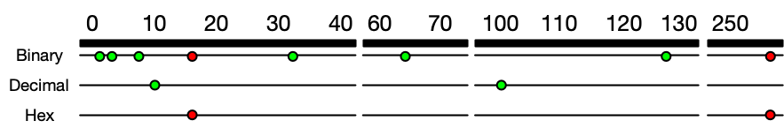

# C++ Nanodegree program notebook
Some notes taken during this C++ course.

## Table of contents
* [Compilation](#compilation)
* [Constants](#constants)
* [Initializer lists](#initializer-lists)
* [References and Pointers](#references-and-pointers)
* [Structures](#structures)
* [Invariants](#invariants)
* [Inheritance vs Composition](#inheritance-vs-composition)
  * [Inheritance](#inheritance)
    * [Friends](#friends)
  * [Composition](#composition)
* [Polymorphism](#polymorphism)
  * [Overloading](#overloading)
  * [Overriding](#overriding)
    * [Virtual functions](#virtual-functions)
* [Templates](#templates)
  * [Deduction](#deduction)
  * [Class templates](#class-templates)
* [Computer memory](#computer-memory)
  * [Structure](#structure)
  * [Types](#types)
* [Cache memory](#cache-memory)
* [Virtual memory](#virtual-memory)

### Compilation
C++ is a compiled programming language, which means that programmers use a program to compile their human-readable source code into machine-readable object and executable files. The program that performs this task is called a compiler.


In order to use classes and functions from the C++ Standard Library, the compiler must have access to a compiled version of the standard library, stored in object files. Most compiler implementations, including GCC, include those object files as part of the installation process. In order to use the Standard Library facilities, the compiler must "link" the standard library object files to the object files created from the programmer's source code.

### Constants
C++ supports two notions of immutability:
* `const`: Run time
* `constexpr`: Compile time

If a variable is set as `static` and initialized inside a class, it has to be `constexpr`.

### Initializer lists
Initializer lists initialize member variables to specific values, just before the class constructor runs. This initialization ensures that class members are automatically initialized when an instance of the class is created, before the object is created.

Constructors should initialize as a rule all member objects in the initialization list. If it's done in the body of the constructor, using `=` assignment operator, it causes a separate, temporary object to be created, and this temporary object is passed into the object's assignment operator and that temporary object is eventually destructed after `;`. Completely inefficient.

Moreover, the member object will get fully constructed by its default constructor, and this might, for example, allocate some default amount of memory or open some default file. All this work could be for naught if the whatever expression and/or assignment operator causes the object to close that file and/or release that memory (e.g., if the default constructor didn't allocate a large enough pool of memory or if it opened the wrong file).

It is mandatory to use initializer lists in the following cases:
1. Initialize a reference
2. Initialize a `const` type
3. Initialize objects which do not have default constructor
4. Initialize base class objects
5. When the constructor's parameter name is same as the attributive of the class

It will not be possible to use initializer lists if [invariants](#invariants) are needed.

### References and Pointers


As a decent rule of thumb, references should be used in place of pointers when possible.

However, there are times when it is not possible to use references. One example is object initialization. You might like one object to store a reference to another object. However, if the other object is not yet available when the first object is created, then the first object will need to use a pointer, not a reference, since a reference cannot be null. The reference could only be initialized once the other object is created.

### Structures
Structures are a user-defined type that allows you to aggregate different other types of data together.

Members of structures can be initialized by default as follows:
```cpp
struct Date
{
  // They are public by default
  int day{1};
  int month{1};
  int year{2000};
  // 1/1/2000
};
```

### Invariants
An invariant is a rule that limits the values of member variables.

As a general rule, member data subject to an invariant should be specified `private`, in order to enforce the invariant before updating the member's value.

### Inheritance vs Composition
Think about an object can do, rather than what is, "has a" (composition) versus "is a" (inheritance).

There is no hard and fast rule about when to prefer composition over inheritance. In general, if a class needs only extend a small amount of functionality beyond what is already offered by another class, it makes sense to inherit from that other class. However, if a class needs to contain functionality from a variety of otherwise unrelated classes, it makes sense to compose the class from those other classes.

#### Inheritance
* `public`: all the members of the base class keep their member access in the derived class.
* `protected`: the public and protected members of the base class change to protected in the derived class.
* `private`: the public and protected members of the base class change to private members of the derived class.

```cpp
#include <vector>
class Vehicle
{
};
class Car : public Vehicle // , public anotherClass --> multiple inheritance
{
};
```
_Be careful, it may conflict if a class derives from multiple base classes that derives from the same abstract class._

##### Friends
The `friend` keyword grants access to the private members of a class.
```cpp
class Heart
{
private:
  int rate;
  friend class Human;
};
class Human
{
public:
  int getHeartRate() const
  {
    return heart_.rate;
  }
private:
  Heart heart_;
};
```
_Human_ is a friend class of _Heart_.

#### Composition
```cpp
class Wheel
{
};
class Car
{
public:
  Car() : wheels(4, Wheel())
  {
  };
private:
  std::vector<Wheel> wheels_;
};
```

### Polymorphism
Polymorphism is means "assuming many forms". It describes a paradigm in which a function may behave differently depending on how it is called. In particular, the function will perform differently based on its inputs.

#### Overloading
It happens when there is more than one function named the same with different parameters.

#### Overriding

##### Virtual functions
Virtual functions are a polymorphic feature. These functions are declared (and possibly defined, implemented) in a base class, and can be overridden by derived classes. A derived class overrides that virtual function by defining its own implementation with an identical function signature

Virtual functions can be defined by derived classes, but this is not required. However, if we mark the virtual function with `= 0` in the base class, then we are declaring the function to be a pure virtual function. This means that the base class does not define this function. A derived class must define this function, or else the derived class will be abstract.
```cpp
#include <iostream>
class Base
{
  virtual void virtualPrint()
  {
    std::cout << "I'm the base virtual print and i do not need to be overridden\n";
  }
  // virtual pure function needs to be overridden
  virtual void virtualPurePrint() = 0;
};
class Derived: public Base
{
  void VirtualPrint() override
  {
    std::cout << "I'm the derived overridden print but I am not mandatory\n";
  }
  // It can be set as virtual in order to follow the same rule in such a case
  // that we have more derived classes from this Derived class
  void virtualPurePrint() override
  {
    std::cout << "I'm a derived virtual pure overridden print and I am mandatory\n";
  }
};
```
_Specifying a function as `override` is good practice, as it empowers the compiler to verify the code, and communicates the intention of the code to future users._

### Templates
Templates in C++ is support for generic programming. Basically, a template is something you can parameterize with types or values.

#### Deduction
Deduction occurs when you instantiate an object without explicitly identifying the types. Instead, the compiler "deduces" the types.
```cpp
#include <assert.h>

template <typename T> T Max(T a, T b)
{
    return a > b ? a : b;
};

int main()
{
  // No need to specify the type such us Max<int>(10, 50)
  assert(Max(10, 50) == 50);
  assert(Max(5.7, 1.436246) == 5.7);
}
```

#### Class templates
Class templates can declare and implement generic attributes for use by generic methods. These templates can be very useful when building classes that will serve multiple purposes.
```cpp
#include <string>
#include <sstream>

template <typename KeyType, typename ValueType>
class Mapping
{
public:
  Mapping(KeyType key, ValueType value) : key(key), value(value)
  {
  }
  std::string Print() const
  {
    std::ostringstream stream;
    stream << key << ": " << value;
    return stream.str();
  }
  KeyType key;
  ValueType value;
};
```

### Computer memory
#### Structure
Information and computers are store as a sequence of zeros and ones called bits.

A `bit` is the smallest piece of information we can have in computing. And eight bits are grouped into something called a `byte`. Bits and bytes are expressed in a Base 2 (binary) number system, which is an alternative to the Base 10 system we are familiar with. There is also a Base 16 (hexadecimal) system, which plays an important role in memory management.

There are several reasons why it is preferable to use hex numbers instead of binary numbers, for instance:
1. **Readability**: It is significantly easier for a human to understand hex numbers as they resemble the decimal numbers we are used to. It is simply not intuitive to look at binary numbers and decide how big they are and how they relate to another binary number.
2. **Information density**: A hex number with two digits can express any number from 0 to 255 (because 16² is 256). To do the same in the binary system, we would require 8 digits. This difference is even more pronounced as numbers get larger and thus harder to deal with.
3. **Conversion into bytes**: Bytes are units of information consisting of 8 bits. Almost all computers are byte-addressed, meaning all memory is referenced by byte, instead of by bit. Therefore, using a counting system that can easily convert into bytes is an important requirement.

Ideally, computer scientists would have used the decimal system, but the conversion between base 2 and base 10 is much harder than between base 2 and base 16. Note in the figure below that the decimal system's digit transitions never match those of the binary system. With the hexadecimal system, which is based on a multiple of 2, digit transitions match up each time, thus making it much easier to convert quickly between these numbering systems.



Each dot represents an increase in the number of digits required to express a number in different number systems. For base 2, this happens at 2, 4, 8, 32, 64, 128 and 256. The red dots indicate positions where several numbering systems align.

The following figure shows an ASCII (_American Standard Code for Information Interchange_) table, where each character (rightmost column) is associated with an 8-digit binary number:


In addition to the decimal number (column "Dec") and the binary number, the ASCII table provides a third number for each character (column "Hex").

#### Types

Common memory types:
* RAM / ROM
* Cache (L1, L2)
* Registers
* Virtual Memory
* Hard Disks, USB drives

When the CPU of a computer needs to access memory, it wants to do this with minimal latency. Also, as large amounts of information need to be processed, the available memory should be sufficiently large with regard to the tasks we want to accomplish.

Regrettably though, low latency and large memory are not compatible with each other (at least not at a reasonable price). In practice, the decision for low latency usually results in a reduction of the available storage capacity (and vice versa). This is the reason why a computer has multiple memory types that are arranged hierarchically.


The CPU and its ultra-fast (but small) registers used for short-term data storage reside at the top of the pyramid. Below are Cache and RAM, which belong to the category of temporary memory which quickly looses its content once power is cut off. Finally, there are permanent storage devices such as the ROM, hard drives as well as removable drives such as USB sticks.

CPU specifications:
1. The **bit size** of the CPU decides how many bytes of data it can access in RAM memory at the same time. A 16-bit CPU can access 2 bytes (with each byte consisting of 8 bit) while a 64-bit CPU can access 8 bytes at a time.
2. The **processing speed** of the CPU is measured in Gigahertz or Megahertz and denotes the number of operations it can perform in one second.

From processing speed and bit size, the data rate required to keep the CPU busy can easily be computed by multiplying bit size with processing speed. With modern CPUs and ever-increasing speeds, the available RAM in the market will not be fast enough to match the CPU data rate requirements.

The idea is to ensure that the CPU is running smoothly without too many white cycles. To make this work, data that is currently needed has to be high up in the hierarchy, while data that is seldomly needed should reside at the lower end.

### Cache memory


### Virtual memory
