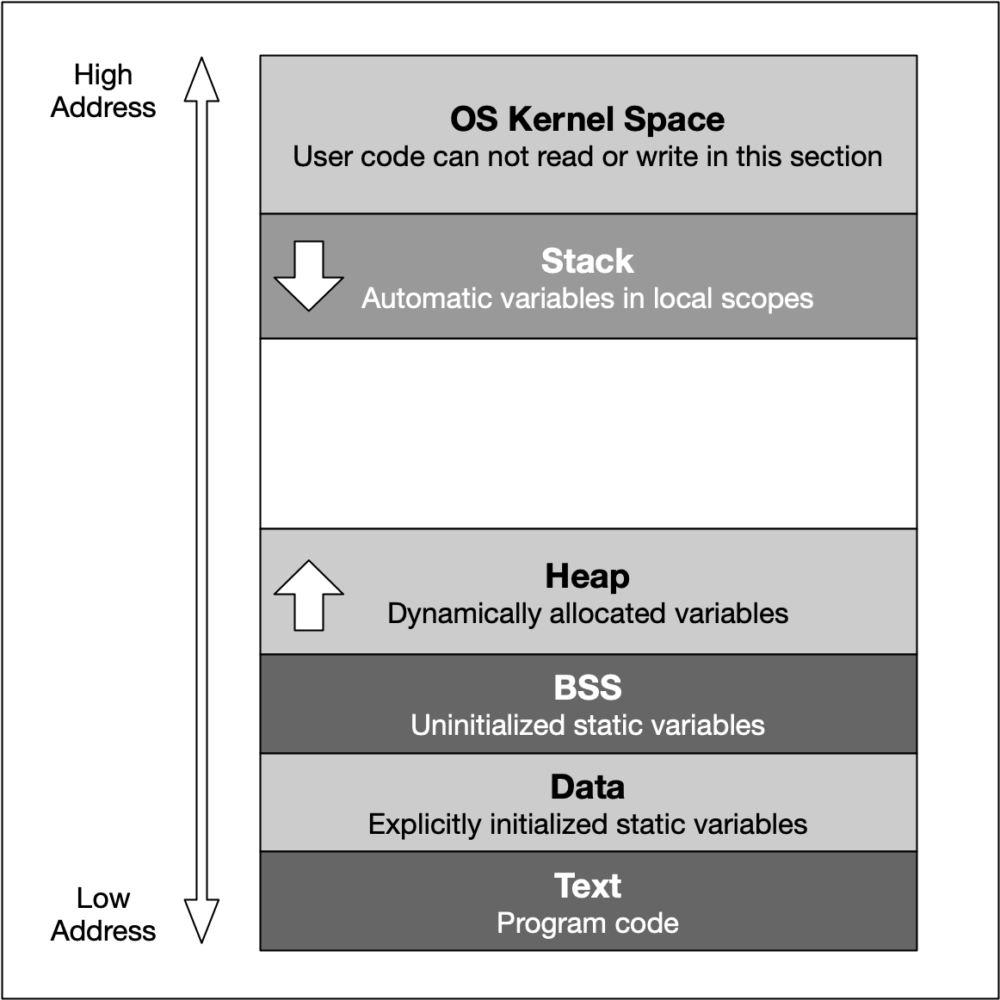

# C++ Nanodegree program notebook
Some notes taken during this C++ course.

## Table of contents
* [Compilation](#compilation)
* [Constants](#constants)
* [Initializer lists](#initializer-lists)
* [References and Pointers](#references-and-pointers)
* [Structures](#structures)
* [Invariants](#invariants)
* [Inheritance vs Composition](#inheritance-vs-composition)
  * [Inheritance](#inheritance)
    * [Friends](#friends)
  * [Composition](#composition)
* [Polymorphism](#polymorphism)
  * [Overloading](#overloading)
  * [Overriding](#overriding)
    * [Virtual functions](#virtual-functions)
* [Templates](#templates)
  * [Deduction](#deduction)
  * [Class templates](#class-templates)
* [Computer memory](#computer-memory)
  * [Structure](#structure)
  * [Types](#types)
* [Cache memory](#cache-memory)
* [Virtual memory](#virtual-memory)
* [Process memory model](#process-memory-model)
* [Memory allocation in C++](#memory-allocation-in-c++)
  * [Static memory allocation](#static-memory-allocation)
  * [Automatic memory allocation (Stack)](#automatic-memory-allocation-stack)
  * [Dynamic memory allocation (Heap)](#dynamic-memory-allocation-heap)
  * [Stack memory](#stack-memory)
  * [Heap memory](#heap-memory)
    * [`malloc()` and `free()`](#malloc-and-free)
    * [`new` and `delete`](#new-and-delete)
  * [Typical memory management problems](#typica-memory-management-problems)
  * [Copy semantics](#copy-semantics)
  * [Lvalues and Rvalues](#lvalues-and-rvalues)
  * [Move semantics](#move-semantics)
* [Passing smart pointers](#passing-smart-pointers)

### Compilation
C++ is a compiled programming language, which means that programmers use a program to compile their human-readable source code into machine-readable object and executable files. The program that performs this task is called a compiler.


In order to use classes and functions from the C++ Standard Library, the compiler must have access to a compiled version of the standard library, stored in object files. Most compiler implementations, including GCC, include those object files as part of the installation process. In order to use the Standard Library facilities, the compiler must "link" the standard library object files to the object files created from the programmer's source code.

### Constants
C++ supports two notions of immutability:
* `const`: Run time
* `constexpr`: Compile time

If a variable is set as `static` and initialized inside a class, it has to be `constexpr`.

### Initializer lists
Initializer lists initialize member variables to specific values, just before the class constructor runs. This initialization ensures that class members are automatically initialized when an instance of the class is created, before the object is created.

Constructors should initialize as a rule all member objects in the initialization list. If it's done in the body of the constructor, using `=` assignment operator, it causes a separate, temporary object to be created, and this temporary object is passed into the object's assignment operator and that temporary object is eventually destructed after `;`. Completely inefficient.

Moreover, the member object will get fully constructed by its default constructor, and this might, for example, allocate some default amount of memory or open some default file. All this work could be for naught if the whatever expression and/or assignment operator causes the object to close that file and/or release that memory (e.g., if the default constructor didn't allocate a large enough pool of memory or if it opened the wrong file).

It is mandatory to use initializer lists in the following cases:
1. Initialize a reference
2. Initialize a `const` type
3. Initialize objects which do not have default constructor
4. Initialize base class objects
5. When the constructor's parameter name is same as the attributive of the class

It will not be possible to use initializer lists if [invariants](#invariants) are needed.

### References and Pointers


As a decent rule of thumb, references should be used in place of pointers when possible.

However, there are times when it is not possible to use references. One example is object initialization. You might like one object to store a reference to another object. However, if the other object is not yet available when the first object is created, then the first object will need to use a pointer, not a reference, since a reference cannot be null. The reference could only be initialized once the other object is created.

In order to benefit from call-by-reference, the size of the data type passed to the function has to surpass the size of the pointer.

### Structures
Structures are a user-defined type that allows you to aggregate different other types of data together.

Members of structures can be initialized by default as follows:
```cpp
struct Date
{
  // They are public by default
  int day{1};
  int month{1};
  int year{2000};
  // 1/1/2000
};
```

### Invariants
An invariant is a rule that limits the values of member variables.

As a general rule, member data subject to an invariant should be specified `private`, in order to enforce the invariant before updating the member's value.

### Inheritance vs Composition
Think about an object can do, rather than what is, "has a" (composition) versus "is a" (inheritance).

There is no hard and fast rule about when to prefer composition over inheritance. In general, if a class needs only extend a small amount of functionality beyond what is already offered by another class, it makes sense to inherit from that other class. However, if a class needs to contain functionality from a variety of otherwise unrelated classes, it makes sense to compose the class from those other classes.

#### Inheritance
* `public`: all the members of the base class keep their member access in the derived class.
* `protected`: the public and protected members of the base class change to protected in the derived class.
* `private`: the public and protected members of the base class change to private members of the derived class.

```cpp
#include <vector>
class Vehicle
{
};
class Car : public Vehicle // , public anotherClass --> multiple inheritance
{
};
```
_Be careful, it may conflict if a class derives from multiple base classes that derives from the same abstract class._

##### Friends
The `friend` keyword grants access to the private members of a class.
```cpp
class Heart
{
private:
  int rate;
  friend class Human;
};
class Human
{
public:
  int getHeartRate() const
  {
    return heart_.rate;
  }
private:
  Heart heart_;
};
```
_Human_ is a friend class of _Heart_.

#### Composition
```cpp
class Wheel
{
};
class Car
{
public:
  Car() : wheels(4, Wheel())
  {
  };
private:
  std::vector<Wheel> wheels_;
};
```

### Polymorphism
Polymorphism is means "assuming many forms". It describes a paradigm in which a function may behave differently depending on how it is called. In particular, the function will perform differently based on its inputs.

#### Overloading
It happens when there is more than one function named the same with different parameters.

#### Overriding

##### Virtual functions
Virtual functions are a polymorphic feature. These functions are declared (and possibly defined, implemented) in a base class, and can be overridden by derived classes. A derived class overrides that virtual function by defining its own implementation with an identical function signature

Virtual functions can be defined by derived classes, but this is not required. However, if we mark the virtual function with `= 0` in the base class, then we are declaring the function to be a pure virtual function. This means that the base class does not define this function. A derived class must define this function, or else the derived class will be abstract.
```cpp
#include <iostream>
class Base
{
  virtual void virtualPrint()
  {
    std::cout << "I'm the base virtual print and i do not need to be overridden\n";
  }
  // virtual pure function needs to be overridden
  virtual void virtualPurePrint() = 0;
};
class Derived: public Base
{
  void VirtualPrint() override
  {
    std::cout << "I'm the derived overridden print but I am not mandatory\n";
  }
  // It can be set as virtual in order to follow the same rule in such a case
  // that we have more derived classes from this Derived class
  void virtualPurePrint() override
  {
    std::cout << "I'm a derived virtual pure overridden print and I am mandatory\n";
  }
};
```
_Specifying a function as `override` is good practice, as it empowers the compiler to verify the code, and communicates the intention of the code to future users._

### Templates
Templates in C++ is support for generic programming. Basically, a template is something you can parameterize with types or values.

#### Deduction
Deduction occurs when you instantiate an object without explicitly identifying the types. Instead, the compiler "deduces" the types.
```cpp
#include <assert.h>

template <typename T> T Max(T a, T b)
{
    return a > b ? a : b;
};

int main()
{
  // No need to specify the type such us Max<int>(10, 50)
  assert(Max(10, 50) == 50);
  assert(Max(5.7, 1.436246) == 5.7);
}
```

#### Class templates
Class templates can declare and implement generic attributes for use by generic methods. These templates can be very useful when building classes that will serve multiple purposes.
```cpp
#include <string>
#include <sstream>

template <typename KeyType, typename ValueType>
class Mapping
{
public:
  Mapping(KeyType key, ValueType value) : key(key), value(value)
  {
  }
  std::string Print() const
  {
    std::ostringstream stream;
    stream << key << ": " << value;
    return stream.str();
  }
  KeyType key;
  ValueType value;
};
```

### Computer memory
#### Structure
Information and computers are store as a sequence of zeros and ones called bits.

A `bit` is the smallest piece of information we can have in computing. And eight bits are grouped into something called a `byte`. Bits and bytes are expressed in a Base 2 (binary) number system, which is an alternative to the Base 10 system we are familiar with. There is also a Base 16 (hexadecimal) system, which plays an important role in memory management.

There are several reasons why it is preferable to use hex numbers instead of binary numbers, for instance:
1. **Readability**: It is significantly easier for a human to understand hex numbers as they resemble the decimal numbers we are used to. It is simply not intuitive to look at binary numbers and decide how big they are and how they relate to another binary number.
2. **Information density**: A hex number with two digits can express any number from 0 to 255 (because 16² is 256). To do the same in the binary system, we would require 8 digits. This difference is even more pronounced as numbers get larger and thus harder to deal with.
3. **Conversion into bytes**: Bytes are units of information consisting of 8 bits. Almost all computers are byte-addressed, meaning all memory is referenced by byte, instead of by bit. Therefore, using a counting system that can easily convert into bytes is an important requirement.

Ideally, computer scientists would have used the decimal system, but the conversion between base 2 and base 10 is much harder than between base 2 and base 16. Note in the figure below that the decimal system's digit transitions never match those of the binary system. With the hexadecimal system, which is based on a multiple of 2, digit transitions match up each time, thus making it much easier to convert quickly between these numbering systems.


Each dot represents an increase in the number of digits required to express a number in different number systems. For base 2, this happens at 2, 4, 8, 32, 64, 128 and 256. The red dots indicate positions where several numbering systems align.

The following figure shows an ASCII (_American Standard Code for Information Interchange_) table, where each character (rightmost column) is associated with an 8-digit binary number:


In addition to the decimal number (column "Dec") and the binary number, the ASCII table provides a third number for each character (column "Hex").

#### Types

Common memory types:
* RAM / ROM
* Cache (L1, L2)
* Registers
* Virtual Memory
* Hard Disks, USB drives

When the CPU of a computer needs to access memory, it wants to do this with minimal latency. Also, as large amounts of information need to be processed, the available memory should be sufficiently large with regard to the tasks we want to accomplish.

Regrettably though, low latency and large memory are not compatible with each other (at least not at a reasonable price). In practice, the decision for low latency usually results in a reduction of the available storage capacity (and vice versa). This is the reason why a computer has multiple memory types that are arranged hierarchically.


The CPU and its ultra-fast (but small) registers used for short-term data storage reside at the top of the pyramid. Below are Cache and RAM, which belong to the category of temporary memory which quickly looses its content once power is cut off. Finally, there are permanent storage devices such as the ROM, hard drives as well as removable drives such as USB sticks.

CPU specifications:
1. The **bit size** of the CPU decides how many bytes of data it can access in RAM memory at the same time. A 16-bit CPU can access 2 bytes (with each byte consisting of 8 bit) while a 64-bit CPU can access 8 bytes at a time.
2. The **processing speed** of the CPU is measured in Gigahertz or Megahertz and denotes the number of operations it can perform in one second.

From processing speed and bit size, the data rate required to keep the CPU busy can easily be computed by multiplying bit size with processing speed. With modern CPUs and ever-increasing speeds, the available RAM in the market will not be fast enough to match the CPU data rate requirements.

The idea is to ensure that the CPU is running smoothly without too many white cycles. To make this work, data that is currently needed has to be high up in the hierarchy, while data that is seldomly needed should reside at the lower end.

### Cache memory
Cache memory is much faster but also significantly smaller than standard RAM. It holds the data that will (or might) be used by the CPU more often. It plays an intermediary role between fast CPU and slow RAM and hard disk. The figure below gives a rough overview of a typical system architecture:


System architecture diagram showing caches, ALU (Arithmetic Logic Unit), main memory, and the buses connected each component.

The central CPU chip is connected to the outside world by a number of buses. There is a cache bus, which leads to a block denoted as L2 cache, and there is a system bus as well as a memory bus that leads to the computer main memory. The latter holds the comparatively large RAM while the L2 cache as well as the L1 cache are very small with the latter also being a part of the CPU itself.


1. **Level 1 cache** is the fastest and smallest memory type in the cache hierarchy. Mostly it is in the range of 16 to 64 kBytes, where the memory areas for instructions and data are separated from each other (L1i and L1d, where "i" stands for "instruction" and "d" stands for "data". The importance of the L1 cache grows with increasing speed of the CPU. In the L1 cache, the most frequently required instructions and data are buffered. This cache avoids delays in data transmission and helps to make optimum use of the CPU's capacity.
2. **Level 2 cache** is located close to the CPU and has a direct connection to it. The information exchange between L2 cache and CPU is managed by the L2 controller on the computer main board. The size of the L2 cache is usually at or below 2 megabytes. On modern multi-core processors, the L2 cache is often located within the CPU itself. With a higher clock speed, individual programs run faster, especially those with high computing requirements. As soon as several programs run simultaneously, a larger cache is advantageous (most preferred).
3. **Level 3 cache** is shared among all cores of a multicore processor. With the L3 cache, the cache coherence protocol of multicore processors can work much faster. This protocol compares the caches of all cores to maintain data consistency so that all processors have access to the same data at the same time. It is intended to simplify and accelerate the cache coherence protocol and the data exchange between the cores.

Programmers can exploit two principles to increase runtime performance:
1. **Temporal locality** means that address ranges that are accessed are likely to be used again in the near future.
2. **Spatial locality** means that after an access to an address range, the next access to an address in the immediate vicinity is highly probable (e.g. in arrays). In the course of time, memory addresses that are very close to each other are accessed again multiple times.

### Virtual memory
Virtual memory is a very useful concept in computer architecture because it helps with making your software work well given the configuration of the respective hardware on the computer it is running on.

Apart from running out of RAM memory, there are several other memory-related problems:
1. **Holes in address space**: If several programs are started one after the other and then shortly afterwards some of these are terminated again, it must be ensured that the freed-up space in between the remaining programs does not remain unused. If memory becomes too fragmented, it might not be possible to allocate a large block of memory due to a large-enough free contiguous block not being available any more.
2. **Programs writing over each other**: If several programs are allowed to access the same memory address, they will overwrite each others' data at this location. In some cases, this might even lead to one program reading sensitive information (e.g. bank account info) that was written by another program. This problem is of particular concern when writing concurrent programs which run several threads at the same time.

The basic idea of virtual memory is to separate the addresses a program may use from the addresses in physical computer memory. By using a mapping function, an access to (virtual) program memory can be redirected to a real address which is guaranteed to be protected from other programs.

The total amount of addressable memory is limited and depends on the architecture of the system. However, with virtual memory, the size of RAM is not the limit anymore as the system hard disk can be used to store information as well.

There are two important terms which are often used in the context of caches and virtual memory:
1. A **memory page** is a number of directly successive memory locations in virtual memory defined by the computer architecture and by the operating system. The computer memory is divided into memory pages of equal size. The use of memory pages enables the operating system to perform virtual memory management. The entire working memory is divided into tiles and each address in this computer architecture is interpreted by the Memory Management Unit (MMU) as a logical address and converted into a physical address.
2. A **memory frame** is mostly identical to the concept of a memory page with the key difference being its location in the physical main memory instead of the virtual memory.

### Process memory model


1. The **stack** is a contiguous memory block with a fixed maximum size. If a program exceeds this size, it will crash. The stack is used for storing automatically allocated variables such as local variables or function parameters. If there are multiple threads in a program, then each thread has its own stack memory. New memory on the stack is allocated when the path of execution enters a scope and freed again once the scope is left. It is important to know that the stack is managed "automatically" by the compiler, which means we do not have to concern ourselves with allocation and deallocation.
2. The **heap** (also called "free store" in C++) is where data with dynamic storage lives. It is shared among multiple threads in a program, which means that memory management for the heap needs to take concurrency into account. In general, managing memory on the heap is more (computationally) expensive for the operating system, which makes it slower than stack memory. f memory is allocated on the heap, it is the programmer’s responsibility to free it again when it is no longer needed. If the programmer manages the heap poorly or not at all, there will be trouble.
3. The **BBS** (Block Started by Symbol) segment is used in many compilers and linkers for a segment that contains global and static variables that are initialized with zero values. This memory area is suitable, for example, for arrays that are not initialized with predefined values.
4. The **Data** segment serves the same purpose as the BSS segment with the major difference being that variables in the Data segment have been initialized with a value other than zero. Memory for variables in the Data segment (and in BSS) is allocated once when a program is run and persists throughout its lifetime.

The blocks "OS Kernel Space" and "Text" are reserved for the operating system. In kernel space, only the most trusted code is executed - it is fully maintained by the operating system and serves as an interface between the user code and the system kernel. The section called 'text' holds the program code generated by the compiler and linker.

### Memory allocation in C++
Not every variable in a program has a permanently assigned area of memory. The term allocate refers to the process of assigning an area of memory to a variable to store its value. A variable is deallocated when the system reclaims the memory from the variable, so it no longer has an area to store its value.

#### Static memory allocation
It is performed for static and global variables, which are stored in the BSS and Data segment. Memory for these types of variables is allocated once when your program is run and persists throughout the life of your program.

#### Automatic memory allocation (Stack)
It is performed for function parameters as well as local variables, which are stored on the stack. Memory for these types of variables is allocated when the path of execution enters a scope and freed again once the scope is left.

#### Dynamic memory allocation (Heap)
It is a possibility for programs to request memory from the operating system at runtime when needed. This is the major difference to automatic and static allocation, where the size of the variable must be known at compile time. Dynamic memory allocation is not performed on the limited stack but on the heap and is thus (almost) only limited by the size of the address space.

#### Stack memory
the stack is the place in virtual memory where the local variables reside, including arguments to functions. Each time a function is called, the stack grows (from top to bottom) and each time a function returns, the stack contracts. When using multiple threads (as in concurrent programming), it is important to know that each thread has its own stack memory - which can be considered thread-safe.

In the following, a short list of key properties of the stack is listed:
1. The stack is a **contiguous block of memory**. It will not become fragmented (as opposed to the heap) and it has fixed maximum size.
2. When the **maximum size of the stack** memory is exceeded, a program will crash.
3. Allocating and deallocating **memory is fast** on the stack. It only involves moving the stack pointer to a new position. The time between allocation and deallocation is called the **lifetime** of a variable.

#### Heap memory
It is an important resource available to programs to store data. The heap memory grows upwards while the stack grows in the opposite direction. We have seen in the last lesson that the automatic stack memory shrinks and grows with each function call and local variable. As soon as the scope of a variable is left, it is automatically deallocated and the stack pointer is shifted upwards accordingly.

Heap memory is different in many ways: The programmer can request the allocation of memory by issuing a command such as `malloc()` or `new`. This block of memory will remain allocated until the programmer explicitly issues a command such as `free()` or `delete`. The huge advantage of heap memory is the high degree of control a programmer can exert, albeit at the price of greater responsibility since memory on the heap must be actively managed.

Properties of heap memory:
1. As opposed to local variables on the stack, memory can now be allocated in an arbitrary scope (e.g. inside a function) without it being deleted when the scope is left. Thus, as long as the address to an allocated block of memory is returned by a function, the caller can freely use it.
2. Local variables on the stack are allocated at compile-time. Thus, the size of e.g. a string variable might not be appropriate as the length of the string will not be known until the program is executed and the user inputs it. With local variables, a solution would be to allocate a long-enough array of and hope that the actual length does not exceed the buffer size. With dynamically allocated heap memory, variables are allocated at run-time. This means that the size of the above-mentioned string variable can be tailored to the actual length of the user input.
3. Heap memory is only constrained by the size of the address space and by the available memory. With modern 64 bit operating systems and large RAM memory and hard disks the programmer commands a vast amount of memory. However, if the programmer forgets to deallocate a block of heap memory, it will remain unused until the program is terminated. This is called a "memory leak".
4. Unlike the stack, the heap is shared among multiple threads, which means that memory management for the heap needs to take concurrency into account as several threads might compete for the same memory resource.
5. When memory is allocated or deallocated on the stack, the stack pointer is simply shifted upwards or downwards. Due to the sequential structure of stack memory management, stack memory can be managed (by the operating system) easily and securely. With heap memory, allocation and deallocation can occur arbitrarily, depending on the lifetime of the variables. This can result in fragmented memory over time, which is much more difficult and expensive to manage.

Memory on the heap can become fragmented and a classic symptom is that you try to allocate a large block and you can’t, even though you appear to have enough memory free. On systems with virtual memory however, this is less of a problem, because large allocations only need to be contiguous in virtual address space, not in physical address space.

When memory is heavily fragmented however, memory allocations will likely take longer because the memory allocator has to do more work to find a suitable space for the new object.

##### `malloc()` and `free()`
To reserve memory on the heap, one of the two functions `malloc()` (stands for Memory Allocation) or `calloc()` (stands for Cleared Memory Allocation) is used. The header file `stdlib.h` or `malloc.h` must be included to use the functions.

```cpp
pointer_name = (cast-type*) malloc(size);
pointer_name = (cast-type*) calloc(num_elems, size_elem);
```

`malloc()` is used to dynamically allocate a single large block of memory with the specified size. It returns a pointer of type `void` which needs to be cast into the appropiate data type it points to.

`calloc()` is used to dynamically allocate the specified number of blocks of memory of the specified type. It initializes each block with a default value '0'.

Both functions return a pointer of type `void` which can be cast into a pointer of any form. If the space for the allocation is insufficient, a NULL pointer is returned.

One of the advantages of these method is that you can adapt the size of the memory block after it has been allocated with the `realloc` function.

```cpp
pointer_name = (cast-type*) realloc( (cast-type*)old_memblock, new_size );
```

If the RAM memory is completely used up, the data is swapped out to the hard disk, which slows down the computer significantly.

The `free()` function releases the reserved memory area so that it can be used again or made available to other programs.
1. `free()` can only free memory that was reserved with `malloc()` or `calloc()`.
2. `free()` can only release memory that has not been released before. Releasing the same block of memory twice will result in an error.

##### `new` and `delete`
They are operators while `malloc()` and `free()` are functions taken from C and thus, they can be overloaded. The major scenarios where it make sense to do it:
1. The overloaded new operator function allows to **add additional parameters**. Therefore, a class can have multiple overloaded new operator functions. This gives the programmer more flexibility in customizing the memory allocation for objects.
2. Overloaded the new and delete operators provides an easy way to **integrate a mechanism similar to garbage collection** capabilities (such as in Java), as we will shorty see later in this course.
3. By adding **exception handling** capabilities into new and delete, the code can be made more robust.
4. It is very easy to add customized behavior, such as overwriting deallocated memory with zeros in order to increase the security of critical application data.

Do not use `new` and `delete` in application code. They belong in the implementation of your abstractions. So if you use a `vector` or a `string`, don't use `new` and `delete`. It's hidden inside the abstraction. That's where the pointers live, in the part and on the fraction that actually touches hardware.

#### Typical memory management problems
Typical errors in memory management:
1. **Memory leaks** occur when data is allocated on the heap at runtime, but not properly deallocated. A program that forgets to clear a memory block is said to have a memory leak - this may be a serious problem or not, depending on the circumstances and on the nature of the program.
2. **Buffer overruns** occur when memory outside the allocated limits is overwritten and thus corrupted. One of the resulting problems is that this effect may not become immediately visible. When a problem finally does occur, cause and effect are often hard to discern. E.g. segmentation fault.
3. **Uninitialized memory**. Depending on the C++ compiler, data structures are sometimes initialized (most often to zero) and sometimes not. So when allocating memory on the heap without proper initialization, it might sometimes contain garbage that can cause problems.
4. **Incorrect pairing of allocation and deallocation**. Freeing a block of memory more than once will cause a program to crash. This can happen when a block of memory is freed that has never been allocated or has been freed before. Such behavior could also occur when improper pairings of allocation and deallocation are used such as using `malloc()` with `delete` or `new` with `free()`.
5. **Invalid memory access** error occurs then trying to access a block of heap memory that has not yet or has already been deallocated.

#### Copy semantics
Copy policies:
1. Default copying
2. No copying
3. Exclusive ownership
4. Deep copying
5. Shared ownership

Using the **default copying** constructor to copy an object that performs a allocation in the heap and a deallocation in the destructor, will end up crashing. When the object goes out of scope, it releases the memory resource and the copy will do the same which causes the program to crash as the pointer is now referencian an invalid are of memory, which has already been freed by the object.

The default behavior of both copy constructor and assignment operator is to perform a _shallow copy_.


To avoid such situation, **exclusive ownership policy** can be used. This policy states that whenever a resource managemnt object is copied, the resource handle is transferred from the source pointer to the destination pointer. In the process, the source pointer is set to `nullptr` to make ownership exclusive. However, one problem in this implementation is that for a short time there are effectively two valid handles to the same resource - after the handle has been copied and before it is set to `nullptr`. In concurrent programs, this would cause a data race for the resource.

To avoid such situation, **deep copying policy** can be used. The idea is to allocate proprietary memory in the destination object and then to copy the content to which the source object handle is pointing into the newly allocated block of memory. This way, the content is preserved during copy or assignment.


However, this approach increases the memory demands and the uniqueness of the data is lost.

To avoid such situation, **shared ownership policy** can be used. The idea is to perform a copy or assignment similar to the default behavior, i.e. copying the handle instead of the content (as with a shallow copy) while at the same time keeping track of the number of instances that also point to the same resource. Each time an instance goes out of scope, the counter is decremented. Once the last object is about to be deleted, it can safely deallocate the memory resource. E.g. shared pointers

**The rule of three**: if you change either the destructor or the copy constructor or the assignement operator, you better change them all to guaranteed a consistent memory management copying policy.

#### Lvalues and Rvalues


* **Lvalues** have an address that can be accessed. They are expressions whose evaluation by the compiler determines the identity of objects or functions.

* **Prvalues** do not have an address that is accessible directly. They are temporary expressions used to initialize objects or compute the value of the operand of an operator. For now on, let refer to **prvalues** as **rvalues**

The two characters `l` and `r` are originally derived from the perspective of the assignment operator `=`, which always expects a rvalue on the right, and which it assigns to a lvalue on the left. In this case, the `l` stands for left and `r` for right.
```cpp
// lvalue = rvalue;
int i = 42;  
```
In more general terms, an lvalue is an entity that points to a specific memory location. An rvalue is usually a short-lived object, which is only needed in a narrow local scope. To simplify things a little, one could think of lvalues as _named containers_ for rvalues.

An **lvalue reference** can be considered as an alternative name for an object. It is a reference that binds to an lvalue and is declared using an optional list of specifiers followed by the reference declarator `&`. One of the primary use-cases for it is the pass-by-reference semantics in function calls.

An **rvalue reference** can be identified from the double ampersand `&&` after a type name. With this operator, it is possible to store and even modify an rvalue.
```cpp
int i = 1;
int j = 2;
int k = i + j; // not efficient manner
// rvalue reference
int &&l = i + j; // very efficient manner
```
One of the most important aspects of rvalue references is that they pave the way for _move semantics_. Move semantics and rvalue references make it possible to write code that transfers resources such as dynamically allocated memory from one object to another in a very efficient manner and also supports the concept of exclusive ownership

#### Move semantics
```cpp
#include <iostream>

void myFunction(int &&val)
{
  std::cout << "val = " << val << std::endl;
}

int main()
{
  myFunction(42);
  return 0;
}
```
The important message of the function argument of `myFunction` to the programmer is: The object that binds to the rvalue reference `&&val` is yours, it is not needed anymore within the scope of the caller (which is main). As discussed in the previous section on rvalue references, this is interesting from two perspectives:
1. Passing values like this **improves performance** as no temporary copy needs to be made anymore and
2. **Ownership changes**, since the object the reference binds to has been abandoned by the caller and now binds to a handle which is available only to the receiver. This could not have been achieved with lvalue references as any change to the object that binds to the lvalue reference would also be visible on the caller side.

_rvalue references are themselves lvalues._
```cpp
int i = 23;
// WRONG!!
myFunction(i)
// CORRECT!!
myFunction(std::move(i));
```
Using `std::move` we state that in the scope of main we will not use i anymore, which now exists only in the scope of `myFunction`.

**The rule of five**: if you have to write one of the functions listed below then you should consider implementing all of them with a proper resource management policy in place:
1. The **destructor**: Responsible for freeing the resource once the object it belongs to goes out of scope.
2. The **assignment operator**: The default assignment operation performs a member-wise shallow copy, which does not copy the content behind the resource handle. If a deep copy is needed, it has be implemented by the programmer.
3. The **copy constructor**: As with the assignment operator, the default copy constructor performs a shallow copy of the data members. If something else is needed, the programmer has to implement it accordingly.
4. The **move constructor**: Because copying objects can be an expensive operation which involves creating, copying and destroying temporary objects, rvalue references are used to bind to an rvalue. Using this mechanism, the move constructor transfers the ownership of a resource from a (temporary) rvalue object to a permanent lvalue object.
5. The **move assignment operator**: With this operator, ownership of a resource can be transferred from one object to another.

**When are move semantics used?**
1. Where heavy-weight objects need to be passed around in a program. Copying these without move semantics can cause series performance issues. The idea in this scenario is to create the object a single time and then "simply" move it around using rvalue references and move semantics.
2. Where ownership needs to be transferred. The primary difference to shared references is that with move semantics we are not sharing anything but instead we are ensuring through a smart policy that only a single object at a time has access to and thus owns the resource.

### Passing smart pointers
```cpp
// Raw pointer
void f( object* );
// Reference
void f( object& );
// Use move semantics to passing an object to a function so that the function takes ownership of the object
void f( unique_ptr<object> );
// Modify a unique pointer and re-use it in the context of the caller
void f( unique_ptr<object>& );
// Store and share ownership of an object on the heap
void f( shared_ptr<object> );
// Need to modify shared pointers and re-use them in the context of the caller 
void f( shared_ptr<object>& );
```